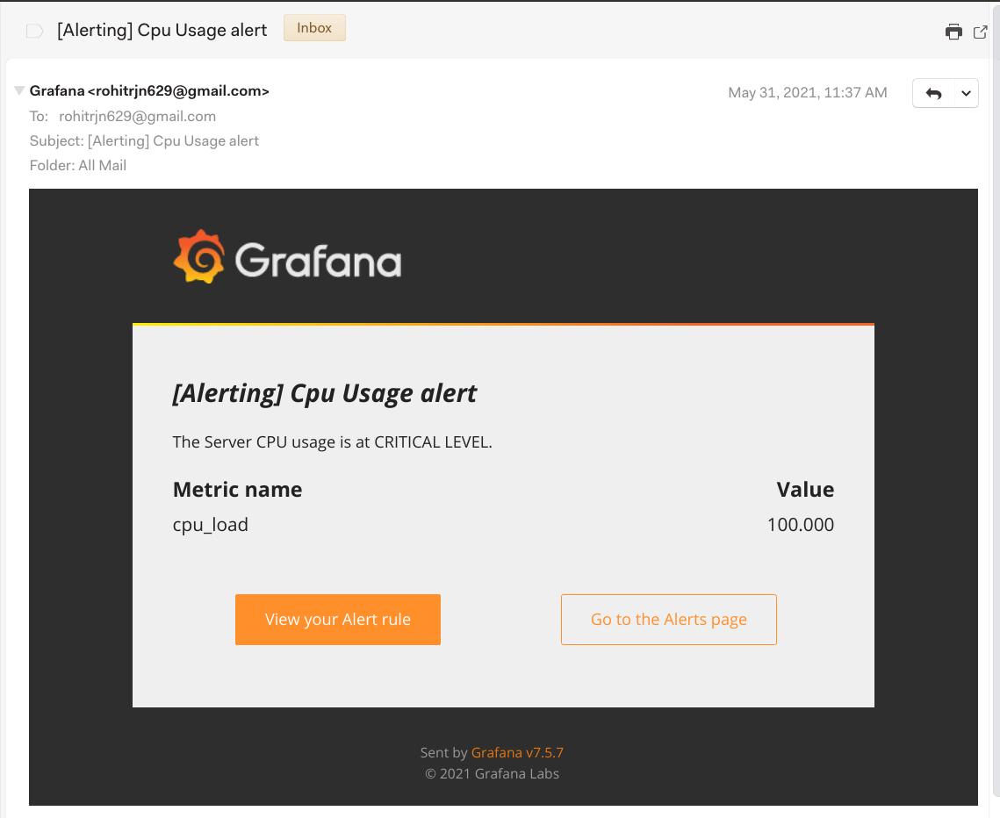

# SYSTEM STATUS DASHBOARD #
Used Python3.8 to populate the influxDB database named **system**, ``psutil`` library for get the
system informations.

The sample code can be shown here:
```
from datetime import date, datetime
from time import sleep
from influxdb import InfluxDBClient
import psutil

client = InfluxDBClient()
client.create_database('system')
client.switch_database('system')

def get_points():
    points = [
        {
            "measurement": "cpu",
            "tags": {
                "machine":'bullst'
            },
            "time": datetime.utcnow().isoformat('T')+'Z',
            "fields": {
                "cpu_load":psutil.cpu_percent()
            }
        },
        {
            "measurement": "ram",
            "tags": {
                "machine":'bullst'
            },
            "time": datetime.utcnow().isoformat('T')+'Z',
            "fields": {
                "ram_usage":psutil.virtual_memory().percent
            }
        }
    ]
    return points

while True:
    client.write_points(get_points())
    client.write_points(get_points())
    sleep(1)
```
The Python code will create two measurements named *cpu*, *ram*. Also, it keeps updating the
status of cpu, ram(usage in %) every 1s.

The sample snapshot of grafana dashboard is here:


The `grafana-server` will create alerts on the basis of RAM/CPU usage. If RAM/CPU % usage crosses 80
then it'll send a alert through mail. A snapshot of **cpu-alert** is shown here:


## How to run ##
Step1:
Run grafana-server:

`sudo service grafana-server start`

Step2:
Run influxDB server:

`sudo service influxdb start`

The above steps for *ubuntu21.04* for windows/docker follow **grafana-docs**.

Save the python code in filename *[populate.py](populate.py)*

On the terminal run:

`python3 populate.py`

Visit to the (https://localhost:3000) to see the dashboard, 
you have to import the json file from [system.json](system.json).

**To get an alert**

*--get an cpu alert*

On the terminal run the following command(*It'll lead to cpu usage of 100%*):

`stress --cpu 8 --timeout 20`

*--get an ram usage alert*

On the terminal run the following command(*It'll lead to ram usage of 3gb*):

`stress --vm 1 --vm-bytes 3G --vm-keep -t 20s`

Change the `3G` to other value depending on your system to reach 80% usage.


